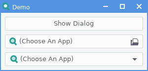
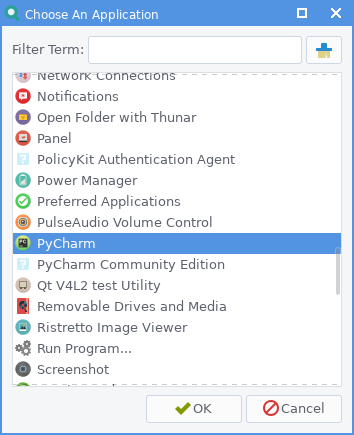
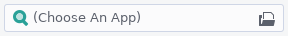
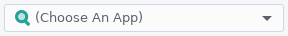
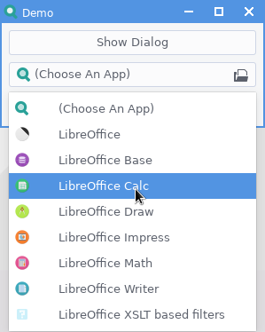
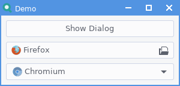

# About
GtkAppChooser is a set of GTK+ 3 objects (2 widgets and 1 dialog) for Python3, allowing selection of installed applications. There exist such widgets in GTK, however I found I was unable to get them to display certain applications, and there seemed to be no option to display ALL applications which you have installed. Therefore, for the exercise if nothing else, I have created these widgets which would allow displaying of all installed applications, along with other features.



- **AppChooserDialog:** GTK Dialog to display all installed apps. Apps can also be filtered by MIME type or filter term. A Gio.AppInfo object for the selected application is returned by the `run()` method.

  

- **AppChooserButton:** GTK Button to open an AppChooserDialog and display the result like a GTK FileChooserButton. A Gio.AppInfo object for the selected application is returned via a new `app-selected` signal, or via the `get_selected_app()` method once the dialog has run.

  

- **AppChooserComboBox:** GTK Combo Box to display apps in a combo box. A Gio.AppInfo object for the selected application can be obtained via the `get_selected_app()` method.

  

  

# Demo
A demo, `demo.py`, is also provided to demonstrate appearance and behaviour of the widgets.



# Usage
Currently this is just the Python classes without any Gtk Builder support. Use them as you would any other widget.

**AppChooserDialog:**
```
my_dialog = AppChooserDialog()
my_app_info = my_dialog.run()
```
**AppChooserButton:**
```
my_button = AppChooserButton()
my_button.connect('app-selected', on_app_selected)

def on_app_selected(app_info):
    my_app_info = app_info
```
**AppChooserComboBox:**
```
my_combo = AppChooserComboBox()
my_combo.connect('changed', on_app_selected)

def on_app_selected(combo):
    my_app_info = my_combo.get_selected_app()

```
**Common Methods:**
- `get/set_mime_types()`:Gets/sets a list of MIME types to show applications for. An empty list means all MIME types are used - This is the default.
- `get/set_search_term()`: Gets/sets a string to use to filter applications by display name. If no term is set, no filtering is done - This is the default.
- `get/set_use_regex()`: Gets/sets whether to use regex for application filtering. If `True`, the filter term is used as a regex pattern for matching applications by their display name. If it is set to `False` then basic, case-insensitive, substring matching of the display name is used - This is the default.
- `get_selected_icon_name()`: Gets the Gio.AppInfo of the selected application.

**IconChooserCombo Methods:**

- `populate()`: Used to populate the combo box with applications. This should be called prior to showing the widget, although this is not done automatically so that you may first set a filter term or desired MIME types.
